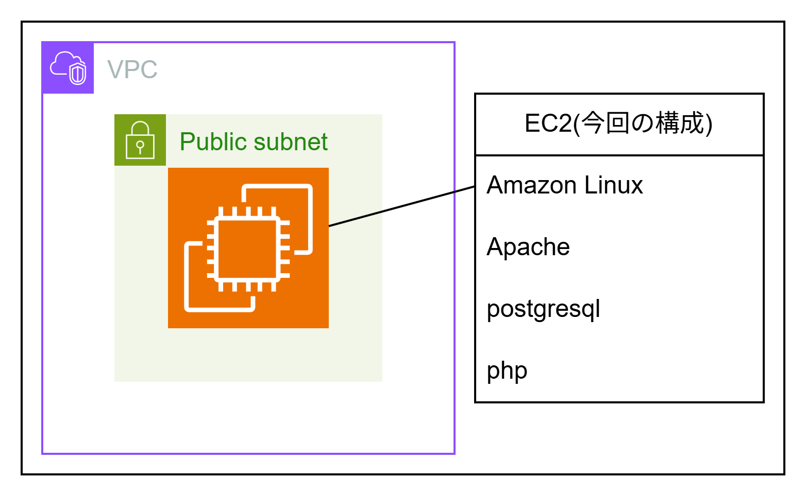

# 2026年3月20日の成果
AWS上でのLAPP環境の構築
## 今回の構成


### セキュリティグループ

| | プロトコル | IP範囲 | ポート番号
|:---:|:---:|:---:|:---:|
|Ingress|SSH|0.0.0.0/0|22|
|Ingress|HTTP|0.0.0.0/0|80|
|Ingress|postgres|0.0.0.0/0|5432|
|Egress|ALL|0.0.0.0/0||

シンプルなLAPP環境の構築を実施
あからさまに脆弱であるのは想定内である。

以下を参考にLAPPの構築を実施
https://docs.aws.amazon.com/ja_jp/linux/al2023/ug/ec2-lamp-amazon-linux-2023.html

この構成は脆弱なのでterraformにてコード化して管理する。

```$ nmap localhost
PORT     STATE SERVICE
22/tcp   open  ssh
25/tcp   open  smtp
80/tcp   open  http
111/tcp  open  rpcbind
5432/tcp open  postgresql
```
smtp、rpcbindは使用予定のないポートなので閉じておくべき</br>
現状teratermから接続しているが、AWSにはSessionManagerでの接続により</br>
SSHのポートを閉じることも可能。22番ポートを閉じることで不正侵入を抑止できる</br>
</br>
LAPPの構築により、パブリックサブネット上のEC2にすべてが入っている</br>
完全に単一障害点となっているので、分散させていくべき