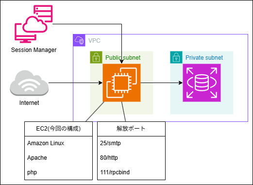

## 2026年3月21日の成果


#### 役割の分離を実施
webとDBが1つのLAPP環境に入っていたため、リソースや負荷に問題がある
WebとDBを分離し、複数の役割を持たせないように修正

#### プライベートサブネットの作成
DBはプライベートサブネットに配置し、外部から直接接続でいないようにした。
パブリックサブネット上のEC2のみからの接続を許可

#### 22番ポートの閉鎖
サーバへの侵入経路になりうる22番ポートを閉鎖し、SSH接続できないように修正
代替方法としてAWSより提供されているSession Managerでの接続をする


## わかったことと課題

**① 111番ポートを閉じようとしたが、使用中のため閉じることができなかった**
 - AWSの仕様なのか確認
 - 無駄に使用されているだけなら修正し閉鎖

**② デフォルトのpsqlだとRDSに接続ができない** 
```
$ curl localhost
<p>Error connecting to DB: SQLSTATE[08006] [7] SCRAM authentication requires libpq version 10 or above</p>
```
 - libpqのバージョンがデフォルトだと低くて接続できない
 - 公式よりprmを取得するなどの対策が必須
 - MySQLへ変更もあり(できればしたくない)

**③ スケーリング**
2台構成などにしてスケーリングをできるようにしたい。