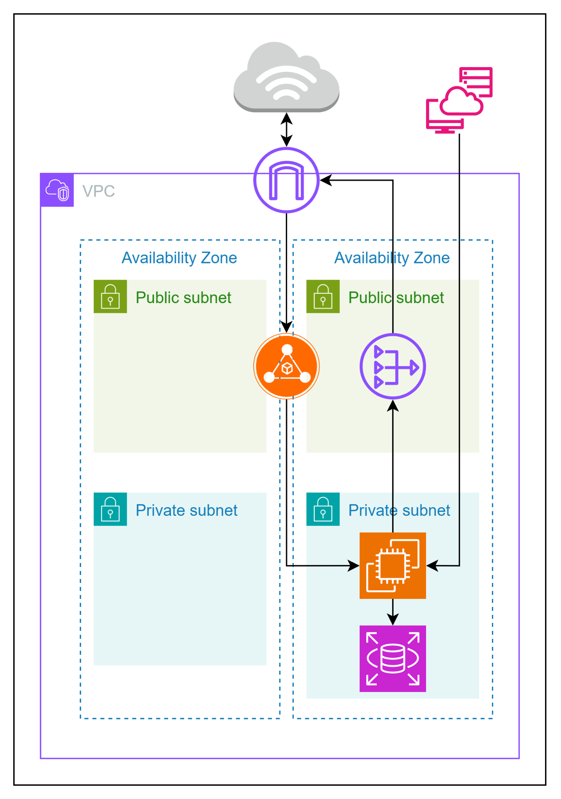

## 2026年3月22日の成果

 - EC2秘匿を目的としたALB設置を実施
 - ALB実施のためマルチAZ構成に変更
 - EC2をプライベートサブネットへ移行
 - EC2はパッケージアップデートのためNAT Gatewayを設置

### わかったこと
 - postgresqの接続用パッケージについて
   - amazon-linux-extras install postgresql14
 - 不要サービスの停止
   - systemctl stop sshd
   - systemctl disable sshd
   - systemctl stop postfix
   - systemctl disable postfix
   - systemctl stop rpcbind.socket
   - systemctl disable rpcbind.socket
   - systemctl stop rpcbind.service
   - systemctl disable rpcbind.service
 - ALBはマルチAZ必須
   - 秘匿化のためにALBを設置したが、単一のAZ・サブネットでは作成できなかった
   - 次回以降、可用性向上のため複数に変更予定
### 次回以降の課題
 - ALB設置後ブラウザからのアクセス方法がわからない
 - 可用性向上、オートスケーリングのやり方